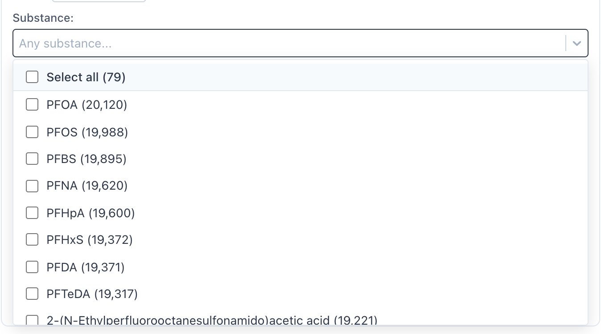

# Substance dropdown

Picks which PFAS chemicals a sample query looks for. Multi select. Leaving it empty means
"any substance".



## What it does

It appears in the query editor whenever the entity type is **Samples**, inside
**+ Add Filters**, above the Material dropdown.

The list is built from the data rather than hardcoded. It shows every substance that has at
least one contaminant observation behind it, sorted by how many observations mention it,
with that number in brackets after the name, like `PFOA (20,120)`. Labels prefer the short
acronym, fall back to the full chemical name when a substance has no acronym recorded, then
to the name of the source data parameter it was matched to, and only then to the bare
DTXSID. In current data every one of the 101 substances resolves to a real name, so the
DTXSID step never fires. Counts are comma formatted.

Being multi select, the list is headed by a Select all row carrying the number of options it
would tick, like `Select all (79)`. Type a search term and that number narrows to the matches.

The list is region aware. Pick a state or some counties in the Region selector and it
narrows to substances actually observed there, with the counts moving to match. Maine, for
example, returns 79 substances. Changing the region triggers a refetch, and each region gets
its own cache entry.

When the query returns nothing, two things can happen:

* **No region selected.** You get seven hardcoded PFAS substances and no counts, so the
  dropdown is never empty on a cold start.
* **A region is selected.** You get an empty list, on purpose. "No PFAS data for this county"
  is real information, and quietly showing national defaults there would be misleading.

## The SPARQL query

Two endpoints, picked by whether a region is set. Without a region it goes to `sawgraph`.
Once a state is chosen it goes to `federation`, because region filtering needs the spatial
graph joined in and only `federation` has both graphs.

```sparql
SELECT ?substance
  (SAMPLE(?_label) AS ?label)
  (SAMPLE(?_short) AS ?short_label)
  (MIN(?_viaParam) AS ?param_label)
  (COUNT(DISTINCT ?observation) AS ?num)
WHERE {
  ?observation rdf:type coso:ContaminantObservation ;
               coso:ofDSSToxSubstance ?substance .
  ?substance a comptox:ChemicalEntity .
  OPTIONAL { ?substance rdfs:label ?_label . }
  OPTIONAL { ?substance skos:altLabel ?_short . }
  OPTIONAL { ?pL comptox:sameAsDSSToxSubstance ?substance ; rdfs:label ?_viaParam . }
} GROUP BY ?substance
ORDER BY DESC(?num) ?label
```

Reading it a line at a time:

* `?observation rdf:type coso:ContaminantObservation` is every recorded measurement in the graph.
* `coso:ofDSSToxSubstance ?substance` is the chemical that measurement was for.
* `?substance a comptox:ChemicalEntity` keeps only real chemical entities.
* `OPTIONAL { rdfs:label ?_label }` is the full name, like "Perfluorooctanoic acid". Only 69
  of the 101 substances have one.
* `OPTIONAL { skos:altLabel ?_short }` is the acronym, like "PFOA". Only 25 have one.
* `OPTIONAL { ?pL comptox:sameAsDSSToxSubstance ... }` reaches back to the source data
  parameter the substance was matched to, and borrows its name. This is what covers the 32
  substances that have no name of their own, taking the list to 101 named out of 101.
* `COUNT(DISTINCT ?observation)` is the number shown in brackets.

`MIN()` rather than `SAMPLE()` on the borrowed name, because 41 substances are matched by
more than one parameter and `SAMPLE()` would pick a different one from run to run.

Both labels are `OPTIONAL` on purpose. A required label pattern does not return an unlabelled
substance, it returns nothing at all for that substance, so the row vanishes from the dropdown
and takes its observations with it. That single mistake broke this dropdown twice, first to
zero rows and then to 32 missing substances. The DTXSID fallback in the hook is the last
resort behind the borrowed name, and is unreachable in current data. It stays anyway,
precisely because a missing label must never delete a row.

`SAMPLE()` is used on both labels because a substance can carry more than one of each and
the dropdown only has room for one. Any of them will do.

### With a region selected

A region pattern gets spliced in, restricting observations to sample points inside the
chosen state or counties:

```sparql
SELECT ?substance
  (SAMPLE(?_label) AS ?label)
  (SAMPLE(?_short) AS ?short_label)
  (MIN(?_viaParam) AS ?param_label)
  (COUNT(DISTINCT ?observation) AS ?num)
WHERE {
  ?sp rdf:type coso:SamplePoint .
  ?sp spatial:connectedTo ?_region .
  ?_region rdf:type kwg-ont:AdministrativeRegion_3 ;
           kwg-ont:administrativePartOf+ ?_regionRoot .
  VALUES ?_regionRoot { kwgr:administrativeRegion.USA.23 }
  ?observation rdf:type coso:ContaminantObservation ;
               coso:observedAtSamplePoint ?sp ;
               coso:ofDSSToxSubstance ?substance .
  ?substance a comptox:ChemicalEntity .
  OPTIONAL { ?substance rdfs:label ?_label . }
  OPTIONAL { ?substance skos:altLabel ?_short . }
  OPTIONAL { ?pL comptox:sameAsDSSToxSubstance ?substance ; rdfs:label ?_viaParam . }
} GROUP BY ?substance
ORDER BY DESC(?num) ?label
```

`administrativeRegion.USA.23` is Maine, FIPS 23. County selections put five digit county
FIPS codes in that same `VALUES` slot instead, so Cumberland County becomes
`administrativeRegion.USA.23005`.

The `AdministrativeRegion_3` hop plus `administrativePartOf+` is what makes one state code
cover everything underneath it. Sample points connect to small regions, and the query walks
up the containment chain until it reaches the state you picked.

Sub county selections, meaning codes longer than five digits, take a different route
entirely. They join with `kwg-ont:sfWithin|kwg-ont:sfTouches` against a Data Commons `geoId`
URI rather than walking the administrative hierarchy.

Verified against the live endpoints on 2026-09-09. The Maine query returns 79 substances,
topped by PFOA at 20120 observations, PFOS at 19988, PFBS at 19895. Unfiltered returns 101,
all of them named, none falling through to a DTXSID.

## How it is wired up

* The control is a shared `FlatSelect`, rendered at
  [`SampleFilters.tsx:35`](https://github.com/SAWGraph/explorer-app/blob/main/src/components/QueryEditor/SampleFilters.tsx#L35).
* Its options come from
  [`useSubstances(region)`](https://github.com/SAWGraph/explorer-app/blob/main/src/hooks/useDiscoveryQueries.ts#L97),
  called at
  [`SampleFilters.tsx:19`](https://github.com/SAWGraph/explorer-app/blob/main/src/components/QueryEditor/SampleFilters.tsx#L19).
* The query text is built by
  [`buildDiscoverSubstancesQuery()`](https://github.com/SAWGraph/explorer-app/blob/main/src/engine/templates/regions.ts#L71),
  and the region part by
  [`buildSamplePointRegionPattern()`](https://github.com/SAWGraph/explorer-app/blob/main/src/engine/templates/regions.ts#L46).
* It runs through
  [`executeSparql()`](https://github.com/SAWGraph/explorer-app/blob/main/src/engine/sparqlClient.ts#L4),
  against the URLs in
  [`endpoints.ts`](https://github.com/SAWGraph/explorer-app/blob/main/src/constants/endpoints.ts).
* Prefixes come from
  [`prefixes.ts`](https://github.com/SAWGraph/explorer-app/blob/main/src/constants/prefixes.ts).
* The fallback list is
  [`FALLBACK_SUBSTANCES`](https://github.com/SAWGraph/explorer-app/blob/main/src/constants/substances.ts#L9).

React Query caches under `['substances', <region key>]` with `staleTime: Infinity`, so it is
one fetch per region per session, and `retry: 1`. `FALLBACK_SUBSTANCES` doubles as
`placeholderData`, which is why the dropdown shows the default PFAS list while a real query
is still in flight.

The label shown in the list is `shortLabel || label`, with the count appended by `withCount()`
at [`SampleFilters.tsx:14`](https://github.com/SAWGraph/explorer-app/blob/main/src/components/QueryEditor/SampleFilters.tsx#L14).
Selecting an option stores both the substance URI and its display label on the question, so
the Analysis Question sentence can say "PFOA" instead of a DSSTox URI.

## If it looks wrong

**Exactly seven PFAS substances and no counts.** You are looking at `FALLBACK_SUBSTANCES`.
Either the endpoint failed, or the query genuinely returned zero rows.

**A bare DTXSID instead of a chemical name.** This should no longer happen. 32 substances
have no `rdfs:label` of their own, but all 32 are named by the parameter they were matched
to, so the list resolves 101 out of 101. Seeing a raw DTXSID means a substance now has
neither, which is new data rather than a code bug.

**A full chemical name where you expected an acronym.** Only 25 substances carry
`skos:altLabel`, so the other 76 show their full name. The source parameters do carry
acronyms for another 44, but they are deliberately not used: the `_A` suffix on them marks
the acid as distinct from the anion, so `PFOS_A` is Perfluorooctanesulfonic acid while
`PFOS` is Perfluorooctanesulfonate, two different DTXSIDs. Adopting them collapsed 10 pairs
of distinct substances into identical looking rows. The full names keep them apart.

**A substance in the list that is not a PFAS.** `Acetohydroxamic acid` shows up with 2
observations. That is an upstream alignment error, not a display bug: the Maine EGAD
parameter `me-egad#parameter.PFECHS_A` is mapped to `DTXSID7022546`, which really is
acetohydroxamic acid. Belongs in an issue against
[pfas-kg](https://github.com/SAWGraph/pfas-kg).

**Empty after picking a county.** There genuinely are no observations there. Expected, not a bug.

**Briefly shows the national list, then empties.** `placeholderData` is unconditional, so the
fallback flashes while the region scoped query resolves and is then replaced by the real
result, empty or otherwise.

**Full chemical names instead of acronyms.** Those substances have no `skos:altLabel` in the
graph. Nothing to fix in the app.

**Stale after changing region.** The region is not reaching the hook. Check the `region` prop
chain into `SampleFilters`, since the cache key is derived from it.

**A note on `dcterms:alternative`.** Earlier versions of this query, and of this page, read the
full name from `dcterms:alternative`. That predicate has zero triples on substances, on
`sawgraph` and on `federation` alike, so the query returned nothing at all and the dropdown sat
on its fallback. An earlier revision of this page blamed the outage on the predicate existing
only on `federation`. That was wrong, both variants were broken. The 3.8M `dcterms:alternative`
triples in `fiokg` are facility alternative names, which is the likely source of the mix up.
Substance names live on `rdfs:label`, which is what the maintainers' own competency question
[`CQ2.rq`](https://github.com/SAWGraph/contaminoso/blob/main/competencyQuestions/CQ2.rq) uses.

## See also

* [Dropdowns](Dropdowns), the index of all filter controls
* [Dropdowns Material](Dropdowns%20Material), which shares the same region pattern
* [`docs/SCHEMA.md`](https://github.com/SAWGraph/explorer-app/blob/main/docs/SCHEMA.md) for the wider predicate inventory
